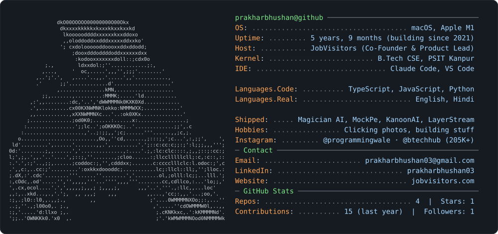

<picture>
  <source media="(prefers-color-scheme: dark)" srcset="dark_mode.svg">
  <source media="(prefers-color-scheme: light)" srcset="light_mode.svg">
  
</picture>

## Projects

| Project | What it is | Stack |
|---|---|---|
| **[LayerStream](https://github.com/PrakharBhushan/layerstream)** | Runs large language models on small machines by streaming one transformer layer at a time. NF4/INT8 compression, a memory planner, and safety guards for 8 GB laptops. Tested against Hugging Face to within 2e-4. | Python, PyTorch |
| **Magician AI** · [live](https://jobvisitors.com/magician-ai) | Grades a resume against ~180K live job roles and returns a shortlist worth applying to: *"Apply to 20, not 200."* Two-stage scoring (rules, then LLM), credit-based pricing, Razorpay. | Node.js, Express, Gemini |
| **MockPe** | Weekly SSC mock tests with All-India ranks and an AI coach, in English and Hindi. | Next.js, TypeScript, Supabase |
| **[KanoonAI](https://github.com/PrakharBhushan/kanoonai)** | Know-your-rights app for India: answers legal questions in English and Hindi, citing the exact section of law. Retrieval over Indian law, plus an emergency recording mode. | React Native, Expo, Supabase pgvector |
| **[JV Interview Generator](https://github.com/PrakharBhushan/jv-interview-generator)** | Generates company-specific interview questions and resume keywords with Claude, scores resumes against a role, and publishes to WordPress. | Next.js, Claude |
| **[Instagram Intelligence Agent](https://github.com/PrakharBhushan/instagram-intelligence-agent)** | Scrapes a competitor's Instagram, analyses every post with Claude Vision, and writes a strategy report. | Node.js, Claude, Apify |
| **[Reel The Deal](https://github.com/PrakharBhushan/reel-the-deal)** | Portfolio and booking site for a photo and video production studio. | React 19, Vite, Tailwind |

Magician AI and MockPe are products with private code. KanoonAI and JV Interview Generator are source-available for review (all rights reserved).

**Contact:** [LinkedIn](https://linkedin.com/in/prakharbhushan03) · [jobvisitors.com](https://jobvisitors.com) · prakharbhushan03@gmail.com

The card above is generated by <code>scripts/build_card.py</code> and refreshed daily by a GitHub Action. The portrait is ASCII made from a photo by <code>scripts/make_ascii.py</code>.
